```bash
$ whoami
```

```yaml
name:        Vishnu Kumar Ruppa Sridhar
role:        AI Software Engineer · building LLM-powered products
focus:       agents · RAG · tool calling, plus the production plumbing around them
ai:          OpenAI · Claude · Llama · LangChain · LangGraph · prompt engineering
background:  6+ yrs full stack · React · Angular · Node.js · Java/Spring Boot · AWS
shipped:     one codebase → 9 brands → web, Android & iOS
education:   MS Management Information Systems @ University at Buffalo (GPA 4.0)
credentials: AWS Data Engineer – Associate · AWS Solutions Architect – Associate (expired)
reachable:   vishnu.rsvk@gmail.com · linkedin.com/in/vishnu-kumar-rs · vishnukumar.me
```

<p>
  <a href="https://github.com/vishnu-ing"></a>
  <a href="https://www.linkedin.com/in/vishnu-kumar-rs/"></a>
  <a href="https://vishnukumar.me/"></a>
  <a href="mailto:vishnu.rsvk@gmail.com"></a>
</p>

---

### &nbsp;❯&nbsp; What I build

<table>
<tr>
<td width="25%" valign="top" align="center">

**LLM-Powered Features**

<sub>LLM agents, RAG and tool calling built into full-stack apps with OpenAI, Claude, LangChain and LangGraph.</sub>

</td>
<td width="25%" valign="top" align="center">

**Multi-Brand Platforms**

<sub>One React + Ionic + Capacitor codebase that themes itself per brand and ships to web, Android and iOS.</sub>

</td>
<td width="25%" valign="top" align="center">

**Java Microservices**

<sub>Spring Boot and Hibernate services for authentication, workflows and integrations, behind clean REST APIs.</sub>

</td>
<td width="25%" valign="top" align="center">

**Cloud & Data on AWS**

<sub>Containerized services, CI/CD and warehouse pipelines, backed by an AWS Data Engineer certification.</sub>

</td>
</tr>
</table>

---

### &nbsp;❯&nbsp; How I ship an LLM feature

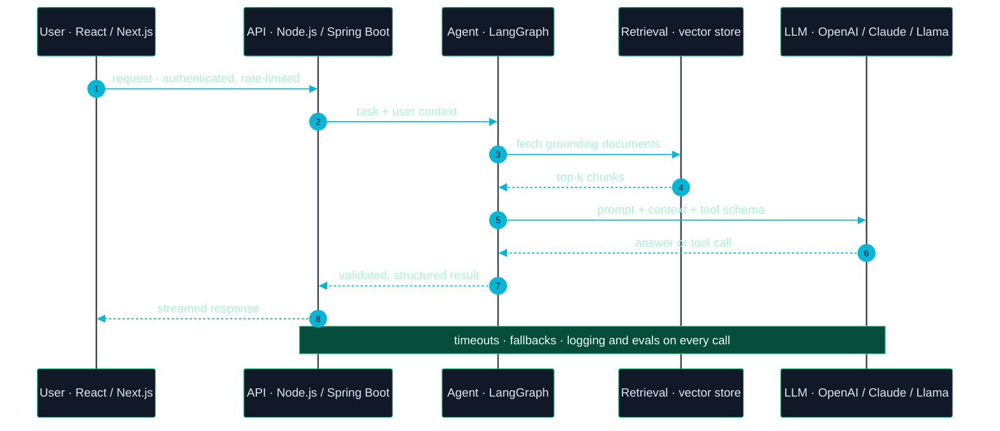

---

### &nbsp;❯&nbsp; The full-stack foundation: how a request flows through my platforms

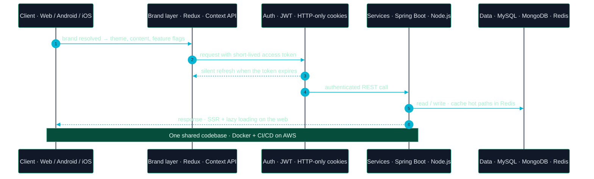

---

### &nbsp;❯&nbsp; Engineering principles

> **Treat the model as an unreliable dependency.** Ground it with retrieval, validate its output, set timeouts and fallbacks, and measure quality with evals instead of vibes.

> **One codebase, many brands.** Theme, content and features are configuration, not forks. Fifteen repositories became one.

> **Secure by default.** JWT with HTTP-only cookies and token refresh is the baseline for every app, not an extra.

> **Performance is a feature.** SSR, lazy loading and lean APIs show up as faster pages, better SEO and response times cut by up to 60%.

---

### &nbsp;❯&nbsp; Technology ecosystem

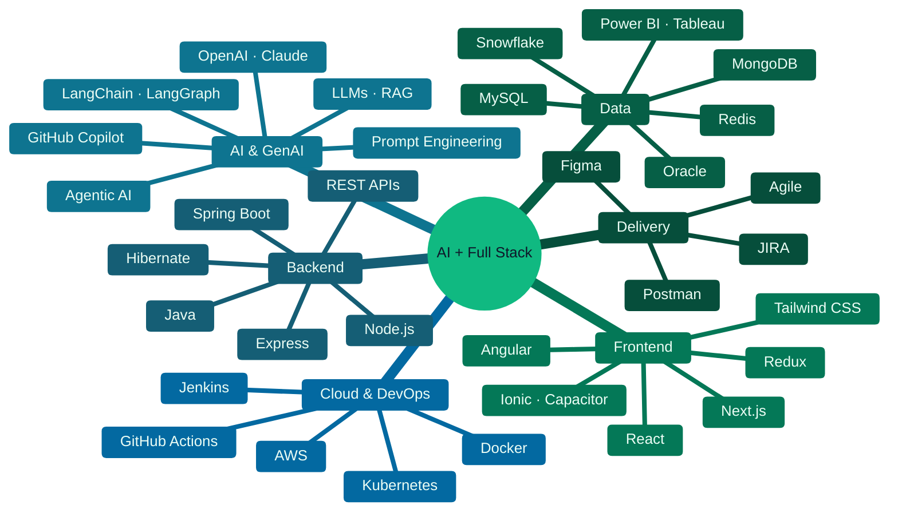

<sub>Primary languages &nbsp;→&nbsp; <code>TypeScript</code> · <code>JavaScript</code> · <code>Java</code> · <code>Python</code> · <code>SQL</code> &nbsp;&nbsp;·&nbsp;&nbsp; Also in production &nbsp;→&nbsp; <code>Docker</code> · <code>Kubernetes</code> · <code>Jenkins</code> · <code>Git</code> · <code>GitLab</code> · <code>CI/CD</code> · <code>Selenium</code> · <code>OpenAI API</code></sub>

---

### &nbsp;❯&nbsp; Career journey

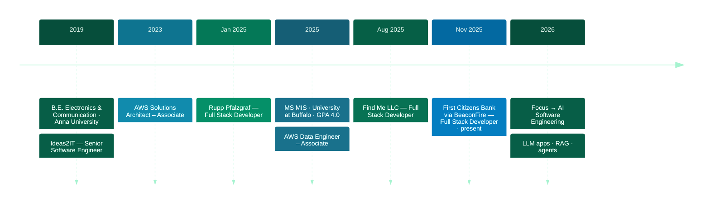

| Period | Company | Role | Key impact |
|:--|:--|:--|:--|
| **Nov 2025 — now** | First Citizens Bank · via BeaconFire | Full Stack Developer | 10+ app pages migrated off legacy SVB branding · SSO & identity hardening · 18 story points vs 10 planned · JWT + OAuth 2.0 |
| **Aug 2025 — Nov 2025** | Find Me LLC | Full Stack Developer | Next.js · Node.js · MongoDB features · Redux Toolkit state · HTTP-only cookie auth · SSR & SEO performance |
| **Jan 2025 — Jun 2025** | Rupp Pfalzgraf | Full Stack Developer | Angular KPI dashboard for C-suite · digitized performance reviews · RxJS + REST APIs |
| **Jun 2019 — May 2024** | Ideas2IT Technology Services | Senior Software Engineer | One codebase → 9 brands on web, Android & iOS · CircleCI CI/CD · Outstanding Performance award, 2 years running |

<details>
<summary><b>Full Stack Developer · First Citizens Bank through BeaconFire</b> &nbsp;—&nbsp; Nov 2025 – present</summary>

<br>

- Modernized more than 10 application pages and shared UI components using React, TypeScript, Node.js and MongoDB to replace legacy SVB branding with the First Citizens experience and support scheduled releases for product and engineering stakeholders.
- Applied approved AI-assisted development tools such as GitHub Copilot to support code exploration, documentation and development productivity while keeping engineering workflows aligned with enterprise development practices.
- Strengthened identity-related repositories and SSO workflows by coordinating security findings, authentication issues and cross-team production dependencies to improve release stability for application, security and platform teams.
- Resolved requirements and product-discovery gaps involving legacy URLs, content changes and component ownership to reduce late-stage ambiguity and improve release readiness across engineering and product teams.
- Delivered approximately 18 story points in a two-week sprint against a planned capacity of 10 by managing competing priorities and cross-team dependencies to meet release and code-freeze commitments.
- Integrated Java and Spring Boot backend services with React-based frontend workflows to support enterprise application functionality and maintain clear separation between presentation, business and integration layers.
- Secured authentication flows with JWT-based access tokens and OAuth 2.0 authorization patterns to protect API resources, standardize session handling and support enterprise identity requirements.
- Improved production support by analyzing application logs, monitoring signals and incident patterns to reduce mean time to resolution (MTTR) for authentication and release-related incidents and strengthen operational reliability for application owners.
- Containerized application workloads with Docker and Kubernetes and supported AWS-based deployment patterns to standardize runtime environments and improve consistency across development and production workflows.

<sub>`React` `TypeScript` `Node.js` `MongoDB` `Java` `Spring Boot` `JWT` `OAuth 2.0` `SSO` `Docker` `Kubernetes` `AWS` `GitHub Copilot`</sub>

</details>

<details>
<summary><b>Full Stack Developer · Find Me LLC</b> &nbsp;—&nbsp; Aug 2025 – Nov 2025</summary>

<br>

- Engineered full-stack features with Next.js, React, TypeScript, Node.js, Express and MongoDB to support application workflows through reusable frontend components and REST-based backend services.
- Reworked client and server state management with Redux Toolkit to provide predictable data flows across Next.js and React applications and simplify application behavior for development teams.
- Hardened authentication by implementing HTTP-only cookies and token refresh workflows with Next.js SSR to improve session security and application performance.
- Optimized application delivery through server-side rendering, static generation, lazy loading and structured sitemaps to improve initial page performance and strengthen SEO-oriented user experiences.
- Built responsive mobile-first interfaces with reusable carousels, tabs, modals and dynamic forms to create consistent user experiences across application workflows.
- Secured API communication with JWT-based authentication and Axios interceptors to manage authorization headers consistently across protected requests.

<sub>`Next.js` `React` `TypeScript` `Node.js` `Express` `MongoDB` `Redux Toolkit` `JWT` `Axios` `SSR`</sub>

</details>

<details>
<summary><b>Full Stack Developer · Rupp Pfalzgraf</b> &nbsp;—&nbsp; Jan 2025 – Jun 2025</summary>

<br>

- Developed an Angular and TypeScript performance dashboard around 4 core KPIs including Revenue per Customer, Total Compensation, Billable Hours and Realization Rate to provide C-suite leadership with a centralized view of business performance.
- Digitized performance review workflows using Angular Material, RxJS and REST APIs to replace fragmented manual processes with centralized dashboards and simplify review activities for managers and administrative stakeholders.
- Structured reusable Angular components and RxJS data flows to standardize API-driven updates and improve frontend maintainability across reporting and performance-management workflows.
- Integrated RESTful backend services with Angular dashboards to support consistent retrieval and presentation of business data for leadership reporting and internal application workflows.
- Refined responsive interfaces using TypeScript, JavaScript, HTML5 and CSS3 to improve navigation and usability across professional-services applications while maintaining reusable frontend patterns.
- Validated frontend and API integrations with Postman, Git-based development and defect analysis to identify integration issues earlier and improve release readiness for business stakeholders.
- Coordinated requirements, code reviews and Agile delivery activities with product and development teams to align dashboard enhancements with stakeholder expectations throughout the engagement.

<sub>`Angular` `TypeScript` `Angular Material` `RxJS` `REST APIs` `HTML5` `CSS3` `Postman` `Agile`</sub>

</details>

<details>
<summary><b>Senior Software Engineer · Ideas2IT Technology Services</b> &nbsp;—&nbsp; Jun 2019 – May 2024</summary>

<br>

- Engineered a hybrid multi-brand application platform using Node.js, Express, MongoDB, React, TypeScript and Ionic to deliver web, Android and iOS applications from a shared codebase for 9 brands, reducing duplicated implementation across product teams.
- Centralized dynamic theming, content, assets and API integrations through React Context API and Redux Toolkit to create reusable application patterns and support consistent promotions and feature rollouts across 9 brands.
- Designed reusable Node.js and Express REST services to separate business logic from client applications and establish consistent API contracts for customer-facing features and third-party integrations.
- Automated development and production deployments through CircleCI and CI/CD pipelines to standardize release execution, reduce manual deployment effort and improve delivery reliability across application environments.
- Integrated geolocation, latitude/longitude-based search and service discovery workflows across 3 application platforms to support location-aware customer journeys and reusable search capabilities.
- Implemented appointment push notifications and coupons/rewards workflows to connect customer interactions with transactional services and engagement features while maintaining reusable business logic across supported brands.
- Earned an Outstanding Performance for Contribution to the Organization award for 2 consecutive years through consistent delivery of cross-platform engineering initiatives and product enhancements.

<sub>`React` `TypeScript` `Ionic` `Node.js` `Express` `MongoDB` `Redux Toolkit` `Context API` `CircleCI` `CI/CD`</sub>

</details>

---

### ❯ Featured engineering projects

<details open>
<summary><b>Agentic AI</b> &nbsp;—&nbsp; tool-using Q&amp;A agent on Llama 3.2</summary>

<br>

AI-powered Q&A agent built with Python and Streamlit. A ReAct agent on **Llama 3.2** decides when to call tools, using a math **FunctionTool** for real-time calculations and the **DuckDuckGo API** for live web search, then composes the answer.

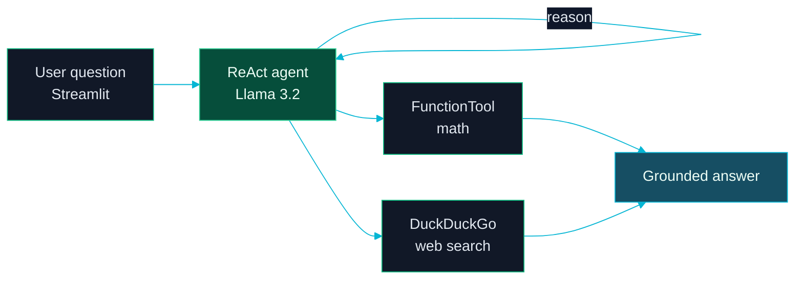

<sub>`Python` `Streamlit` `Llama 3.2` `ReActAgent` `FunctionTool` `DuckDuckGo API`</sub>

</details>

<details>
<summary><b>E-Commerce Microservices Platform</b> — distributed commerce backend with cloud-native architecture</summary>
<br>

Built a Spring Boot and Spring Cloud based e-commerce backend organized into independent services for users, products, favourites, orders, shipping and payments. The system includes service discovery, centralized configuration, an API gateway and a dedicated authentication/authorization service. Docker Compose coordinates the service landscape and Kafka-based messaging, while the repository also includes Kubernetes configuration, observability through Actuator, Prometheus and Zipkin, resilience patterns with Resilience4j, and integration testing with Testcontainers.

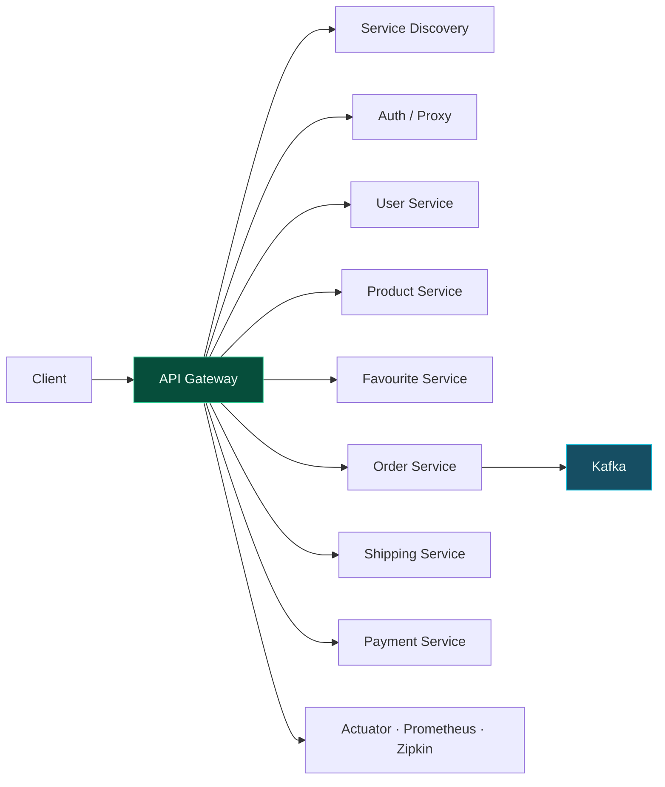

<sub>`Java 11` `Spring Boot` `Spring Cloud` `Microservices` `REST APIs` `Docker` `Kubernetes` `Kafka` `Resilience4j` `Prometheus` `Zipkin` `Testcontainers`</sub>

</details>

<details>
<summary><b>Spring Boot Microservices Banking Application</b> — modular banking platform with service discovery and API gateway</summary>
<br>

Developed a modular banking backend using Spring Boot, Spring Data JPA, Spring Cloud and Spring Security. The application separates user management, account operations, fund transfers and transaction processing into independent services, with a Service Registry handling service discovery and an API Gateway providing a centralized entry point for the APIs. The repository also includes a sequence generator, documentation and a Postman collection for API testing.

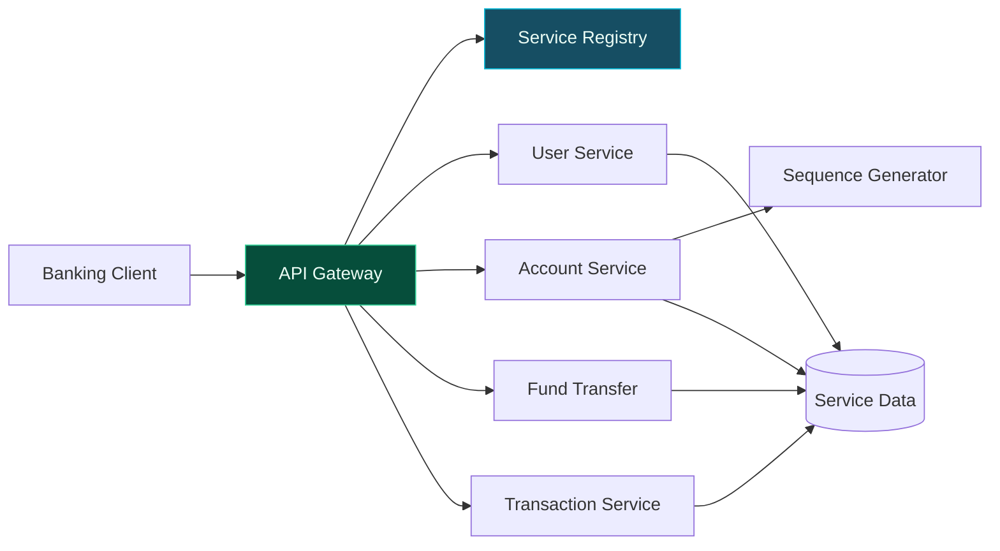

<sub>`Java` `Spring Boot` `Spring Cloud` `Spring Data JPA` `Spring Security` `Maven` `REST APIs` `Microservices` `API Gateway` `Service Discovery`</sub>

</details>

<details>
<summary><b>Centralized Asset Management & Compliance Dashboard</b> — centralized security and compliance monitoring</summary>
<br>

Built a centralized asset-management dashboard for monitoring security and compliance across virtualized Linux and Windows environments. The system includes security assessment, CIS Benchmark compliance checks and Data Loss Prevention capabilities, with Vagrant used to provision Ubuntu Desktop, Ubuntu Server, Windows 10 and Windows 11 environments. A Node.js backend and responsive HTML, CSS and JavaScript dashboard provide centralized visibility into asset security, compliance and DLP status.

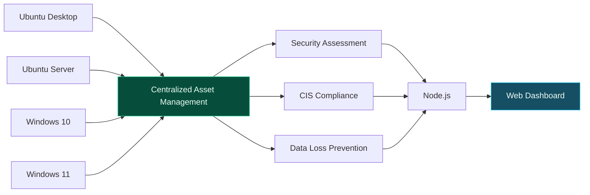

<sub>`Node.js` `JavaScript` `HTML` `CSS` `Vagrant` `Linux` `Windows` `CIS Benchmarks` `Security Assessment` `DLP`</sub>

</details>

<details>
<summary><b>Online Banking Full-Stack Application</b> — React and Redux banking interface backed by Spring</summary>
<br>

Built a single-page online banking frontend using React and Redux, integrated with a Java Spring REST API. The application supports user registration and login, account history, opening new accounts, transfers between accounts, deposits, withdrawals and payments. Redux manages application state across components, while Redux Thunk handles asynchronous operations and Material UI provides the interface components. The application also includes account-flow visualizations and integrates with the backend through authenticated API communication.

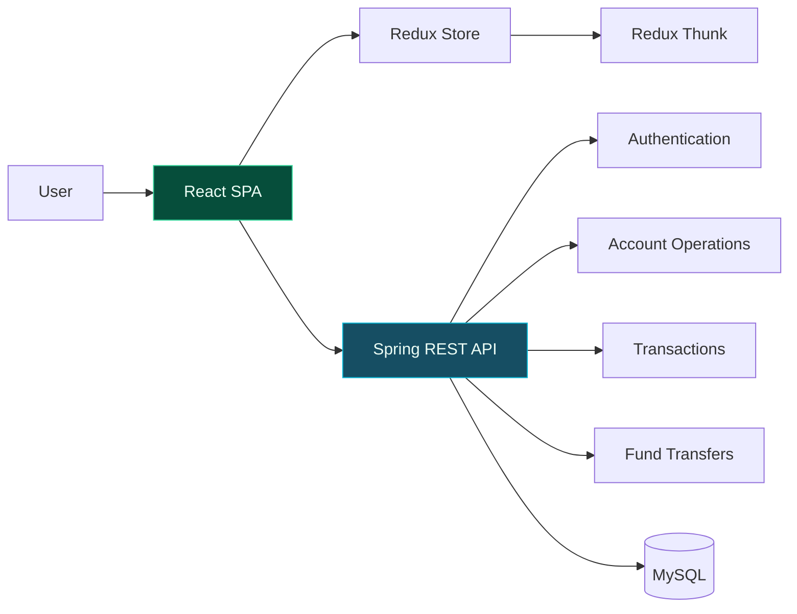

<sub>`React` `Redux` `Redux Thunk` `React Router` `Material UI` `JavaScript` `Spring Boot` `REST API` `JWT` `Cookies` `MySQL`</sub>

</details>

<details>
<summary><b>Distributed Bookstore Platform</b> — multi-service application with catalog, orders, billing and payments</summary>
<br>

Structured a distributed bookstore application into independent services covering account management, catalog, ordering, billing and payments. The repository includes a dedicated API Gateway and Eureka discovery service alongside a React frontend, with separate components for monitoring and observability. The service-oriented structure separates core business capabilities while allowing the frontend to consume the distributed backend through a centralized gateway.

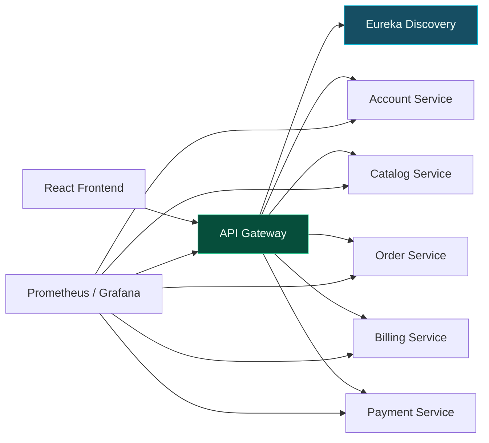

<sub>`Java` `Spring Boot` `Spring Cloud` `Microservices` `React` `API Gateway` `Eureka` `REST APIs` `Prometheus` `Grafana`</sub>

</details>

---

### &nbsp;❯&nbsp; Impact at a glance

<table>
<tr>
<td align="center" width="20%"><b>15 → 1</b><br><sub>repos consolidated</sub></td>
<td align="center" width="20%"><b>9</b><br><sub>brands on one codebase</sub></td>
<td align="center" width="20%"><b>70%</b><br><sub>easier maintenance</sub></td>
<td align="center" width="20%"><b>50%</b><br><sub>faster deployments</sub></td>
<td align="center" width="20%"><b>60%</b><br><sub>faster client responses</sub></td>
</tr>
</table>

---

### &nbsp;❯&nbsp; Credentials

<p>
  <a href="https://www.credly.com/badges/e5ba4d04-1c03-4083-b302-9a333f105dc4"></a>
  &nbsp;
  <a href="https://www.credly.com/badges/f42ceef1-91b4-4af3-acda-124766242d70"></a>
</p>

| Year | Credential | Issuer |
|:--|:--|:--|
| 2025 | [AWS Certified Data Engineer – Associate](https://www.credly.com/badges/f42ceef1-91b4-4af3-acda-124766242d70) | Amazon Web Services |
| 2025 | MS Management Information Systems · GPA 4.0 | University at Buffalo, SUNY |
| 2024 | [Snowflake Data Warehousing Workshop](https://achieve.snowflake.com/deb625a0-411a-4d9c-a1f0-7f72fb122e75#acc.wFYqZ5r7) | Snowflake |
| 2024 | [Tableau: Connect and Transform Data](https://www.credly.com/badges/6fc17ca5-661d-4593-8f47-8711dc24d659/public_url) · [Create Views and Dashboards](https://www.credly.com/badges/b55846f4-7a23-4a72-a884-68fae744f805/public_url) | Tableau |
| 2023 | [AWS Certified Solutions Architect – Associate](https://www.credly.com/badges/e5ba4d04-1c03-4083-b302-9a333f105dc4) | Amazon Web Services |

---

### &nbsp;❯&nbsp; GitHub

<!-- animated contribution graph + stats card, built from real data.
     regenerated daily by .github/workflows/update-profile-art.yml
     (scripts/fetch_contributions.py → render_heatmap_svg.py → render_stats_svg.py) -->

<div align="center">

<h3><code>vishnu@github ~ $ ./contributions.sh</code></h3>


<br>
<br>

<h3><code>vishnu@github ~ $ ./stats.sh</code></h3>


</div>

---

### &nbsp;❯&nbsp; Currently exploring

```text
→ event-driven services on AWS (Lambda · EventBridge · SQS)
→ cloud data warehousing with Snowflake alongside app backends
→ agentic workflows with LangGraph and tool-calling LLMs
→ RAG over product and operational data
```

---

<div align="center">

```bash
$ reach me
→ email     vishnu.rsvk@gmail.com
→ linkedin  linkedin.com/in/vishnu-kumar-rs
→ github    github.com/vishnu-ing
```

<sub>Open to AI Software Engineer roles: LLM-powered products, agents and RAG, backed by full-stack depth.</sub>

</div>
