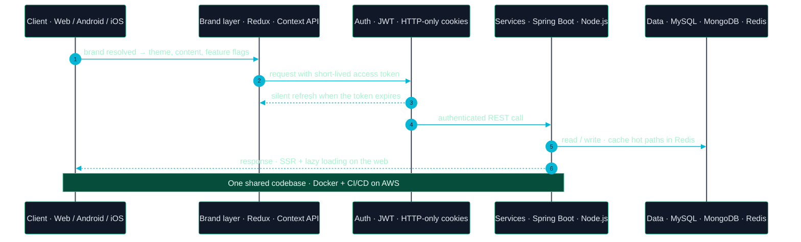
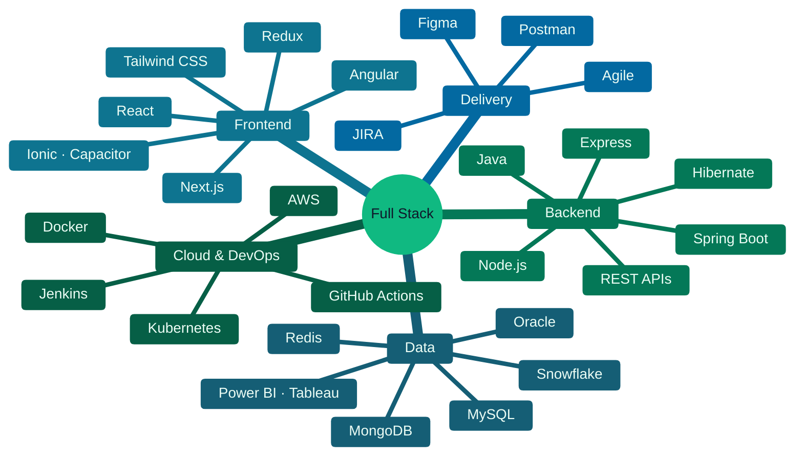
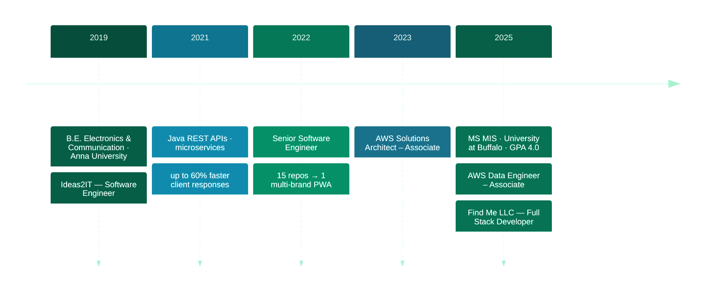
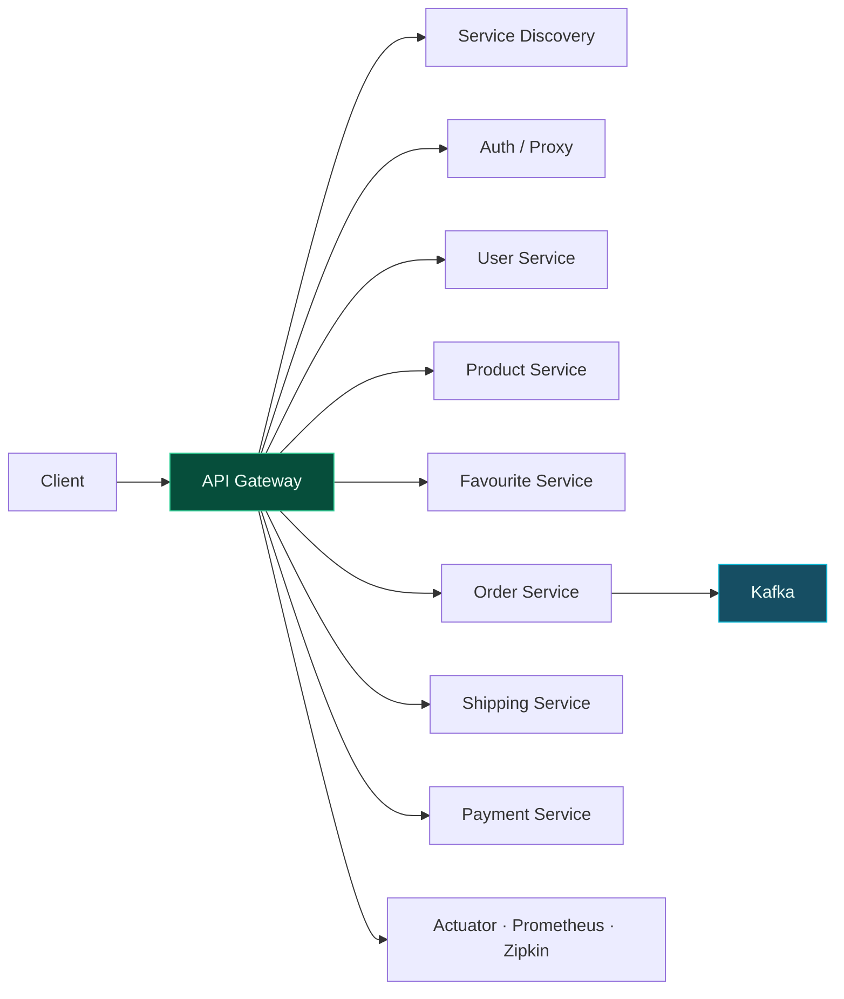
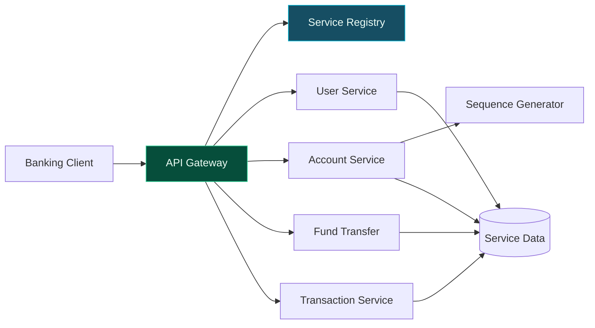
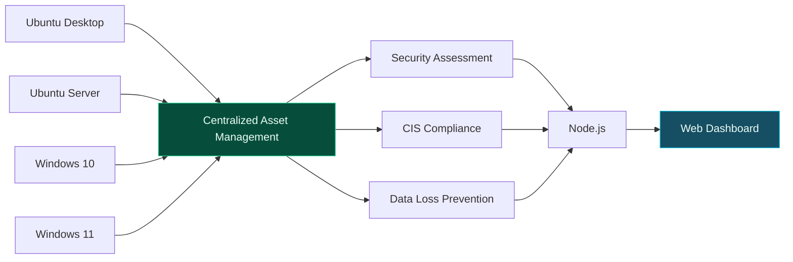
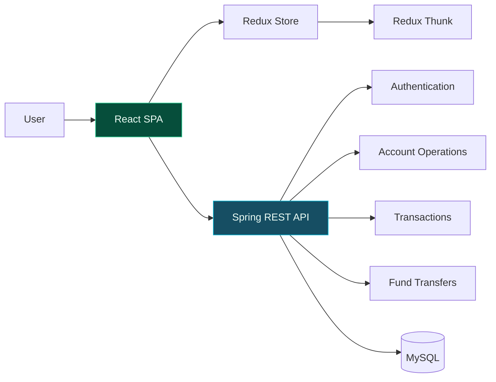
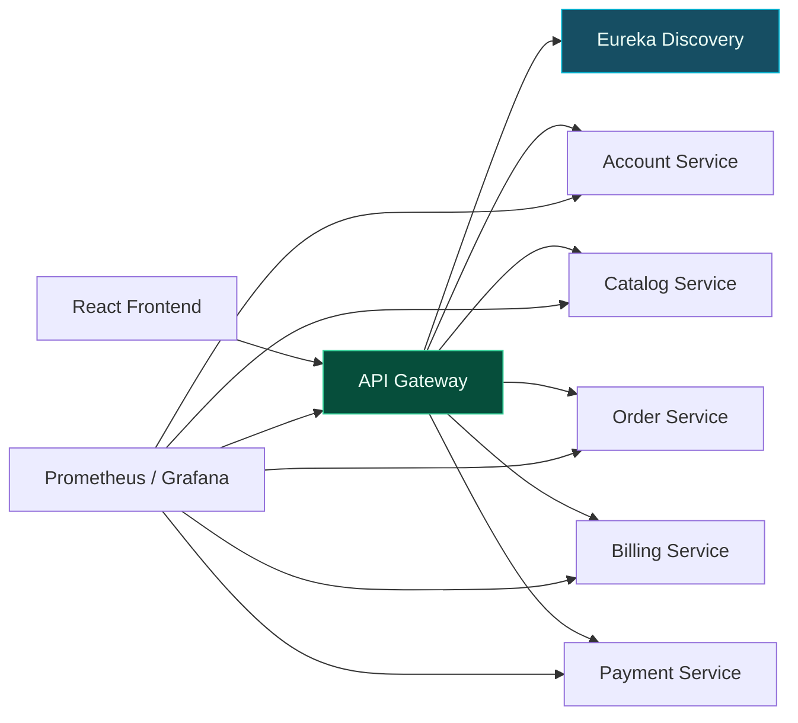

```bash
$ whoami
```

```yaml
name:        Vishnu Kumar Ruppa Sridhar
role:        Full Stack Developer · Microservices Engineer
focus:       multi-brand web & mobile platforms, Java microservices, cloud
stack:       React · Ionic · TypeScript  ⇄  Java · Spring Boot · Node.js
shipped:     one codebase → 9 brands → web, Android & iOS
education:   MS Management Information Systems @ University at Buffalo (GPA 4.0)
credentials: AWS Solutions Architect – Associate · AWS Data Engineer – Associate
reachable:   vishnu.rsvk@gmail.com · linkedin.com/in/vishnu-kumar-ruppa-sridhar
```

<p>
  <a href="https://github.com/vishnu-ing"></a>
  <a href="https://www.linkedin.com/in/vishnu-kumar-ruppa-sridhar/"></a>
  <a href="mailto:vishnu.rsvk@gmail.com"></a>
</p>

---

### &nbsp;❯&nbsp; What I build

<table>
<tr>
<td width="33%" valign="top" align="center">

**Multi-Brand Platforms**

<sub>One React + Ionic + Capacitor codebase that themes itself per brand and ships to web, Android and iOS.</sub>

</td>
<td width="33%" valign="top" align="center">

**Java Microservices**

<sub>Spring Boot and Hibernate services for authentication, workflows and integrations, behind clean REST APIs.</sub>

</td>
<td width="33%" valign="top" align="center">

**Cloud & Data on AWS**

<sub>Containerized services, CI/CD and warehouse pipelines, designed with two AWS Associate certifications behind them.</sub>

</td>
</tr>
</table>

---

### &nbsp;❯&nbsp; How a request flows through my platforms



---

### &nbsp;❯&nbsp; Engineering principles

> **One codebase, many brands.** Theme, content and features are configuration, not forks. Fifteen repositories became one.

> **Secure by default.** JWT with HTTP-only cookies and token refresh is the baseline for every app, not an extra.

> **Performance is a feature.** SSR, lazy loading and lean APIs show up as faster pages, better SEO and response times cut by up to 60%.

---

### &nbsp;❯&nbsp; Technology ecosystem



<sub>Primary languages &nbsp;→&nbsp; <code>TypeScript</code> · <code>JavaScript</code> · <code>Java</code> · <code>Python</code> · <code>SQL</code> &nbsp;&nbsp;·&nbsp;&nbsp; Also in production &nbsp;→&nbsp; <code>Docker</code> · <code>Kubernetes</code> · <code>Jenkins</code> · <code>Git</code> · <code>GitLab</code> · <code>CI/CD</code> · <code>Selenium</code> · <code>OpenAI API</code></sub>

---

### &nbsp;❯&nbsp; Career journey



| Period | Company | Role | Key impact |
|:--|:--|:--|:--|
| **Aug 2025 — Nov 2025** | Find Me LLC | Full Stack Developer | React · Next.js · Node.js · MongoDB features · microservice-style REST APIs · faster auth and SSR |
| **Jul 2022 — May 2024** | Ideas2IT Technology Services | Senior Software Engineer | 15 repos → 1 PWA · 9 brands on web, Android & iOS · 70% easier maintenance · 50% faster deploys · led a team of 4 |
| **2019 — Jul 2022** | Ideas2IT Technology Services | Software Engineer | Java REST APIs · up to 60% faster client responses · microservices with automated CI/CD |

---

### ❯ Featured engineering projects

<details open>
<summary><b>E-Commerce Microservices Platform</b> — distributed commerce backend with cloud-native architecture</summary>
<br>

Built a Spring Boot and Spring Cloud based e-commerce backend organized into independent services for users, products, favourites, orders, shipping and payments. The system includes service discovery, centralized configuration, an API gateway and a dedicated authentication/authorization service. Docker Compose coordinates the service landscape and Kafka-based messaging, while the repository also includes Kubernetes configuration, observability through Actuator, Prometheus and Zipkin, resilience patterns with Resilience4j, and integration testing with Testcontainers.



<sub>`Java 11` `Spring Boot` `Spring Cloud` `Microservices` `REST APIs` `Docker` `Kubernetes` `Kafka` `Resilience4j` `Prometheus` `Zipkin` `Testcontainers`</sub>

</details>

<details>
<summary><b>Spring Boot Microservices Banking Application</b> — modular banking platform with service discovery and API gateway</summary>
<br>

Developed a modular banking backend using Spring Boot, Spring Data JPA, Spring Cloud and Spring Security. The application separates user management, account operations, fund transfers and transaction processing into independent services, with a Service Registry handling service discovery and an API Gateway providing a centralized entry point for the APIs. The repository also includes a sequence generator, documentation and a Postman collection for API testing.



<sub>`Java` `Spring Boot` `Spring Cloud` `Spring Data JPA` `Spring Security` `Maven` `REST APIs` `Microservices` `API Gateway` `Service Discovery`</sub>

</details>

<details>
<summary><b>Centralized Asset Management & Compliance Dashboard</b> — centralized security and compliance monitoring</summary>
<br>

Built a centralized asset-management dashboard for monitoring security and compliance across virtualized Linux and Windows environments. The system includes security assessment, CIS Benchmark compliance checks and Data Loss Prevention capabilities, with Vagrant used to provision Ubuntu Desktop, Ubuntu Server, Windows 10 and Windows 11 environments. A Node.js backend and responsive HTML, CSS and JavaScript dashboard provide centralized visibility into asset security, compliance and DLP status.



<sub>`Node.js` `JavaScript` `HTML` `CSS` `Vagrant` `Linux` `Windows` `CIS Benchmarks` `Security Assessment` `DLP`</sub>

</details>

<details>
<summary><b>Online Banking Full-Stack Application</b> — React and Redux banking interface backed by Spring</summary>
<br>

Built a single-page online banking frontend using React and Redux, integrated with a Java Spring REST API. The application supports user registration and login, account history, opening new accounts, transfers between accounts, deposits, withdrawals and payments. Redux manages application state across components, while Redux Thunk handles asynchronous operations and Material UI provides the interface components. The application also includes account-flow visualizations and integrates with the backend through authenticated API communication.



<sub>`React` `Redux` `Redux Thunk` `React Router` `Material UI` `JavaScript` `Spring Boot` `REST API` `JWT` `Cookies` `MySQL`</sub>

</details>

<details>
<summary><b>Distributed Bookstore Platform</b> — multi-service application with catalog, orders, billing and payments</summary>
<br>

Structured a distributed bookstore application into independent services covering account management, catalog, ordering, billing and payments. The repository includes a dedicated API Gateway and Eureka discovery service alongside a React frontend, with separate components for monitoring and observability. The service-oriented structure separates core business capabilities while allowing the frontend to consume the distributed backend through a centralized gateway.



<sub>`Java` `Spring Boot` `Spring Cloud` `Microservices` `React` `API Gateway` `Eureka` `REST APIs` `Prometheus` `Grafana`</sub>

</details>

---

### &nbsp;❯&nbsp; Impact at a glance

<table>
<tr>
<td align="center" width="20%"><b>15 → 1</b><br><sub>repos consolidated</sub></td>
<td align="center" width="20%"><b>9</b><br><sub>brands on one codebase</sub></td>
<td align="center" width="20%"><b>70%</b><br><sub>easier maintenance</sub></td>
<td align="center" width="20%"><b>50%</b><br><sub>faster deployments</sub></td>
<td align="center" width="20%"><b>60%</b><br><sub>faster client responses</sub></td>
</tr>
</table>

---

### &nbsp;❯&nbsp; Credentials

<p>
  <a href="https://www.credly.com/badges/e5ba4d04-1c03-4083-b302-9a333f105dc4"></a>
  &nbsp;
  <a href="https://www.credly.com/badges/f42ceef1-91b4-4af3-acda-124766242d70"></a>
</p>

| Year | Credential | Issuer |
|:--|:--|:--|
| 2025 | [AWS Certified Data Engineer – Associate](https://www.credly.com/badges/f42ceef1-91b4-4af3-acda-124766242d70) | Amazon Web Services |
| 2025 | MS Management Information Systems · GPA 4.0 | University at Buffalo, SUNY |
| 2024 | [Snowflake Data Warehousing Workshop](https://achieve.snowflake.com/deb625a0-411a-4d9c-a1f0-7f72fb122e75#acc.wFYqZ5r7) | Snowflake |
| 2024 | [Tableau: Connect and Transform Data](https://www.credly.com/badges/6fc17ca5-661d-4593-8f47-8711dc24d659/public_url) · [Create Views and Dashboards](https://www.credly.com/badges/b55846f4-7a23-4a72-a884-68fae744f805/public_url) | Tableau |
| 2023 | [AWS Certified Solutions Architect – Associate](https://www.credly.com/badges/e5ba4d04-1c03-4083-b302-9a333f105dc4) | Amazon Web Services |

---

### &nbsp;❯&nbsp; GitHub

<!-- animated contribution graph + stats card, built from real data.
     regenerated daily by .github/workflows/update-profile-art.yml
     (scripts/fetch_contributions.py → render_heatmap_svg.py → render_stats_svg.py) -->

<div align="center">

<h3><code>vishnu@github ~ $ ./contributions.sh</code></h3>


<br>
<br>

<h3><code>vishnu@github ~ $ ./stats.sh</code></h3>


</div>

---

### &nbsp;❯&nbsp; Currently exploring

```text
→ event-driven services on AWS (Lambda · EventBridge · SQS)
→ cloud data warehousing with Snowflake alongside app backends
→ LLM features inside everyday product workflows
```

---

<div align="center">

```bash
$ reach me
→ email     vishnu.rsvk@gmail.com
→ linkedin  linkedin.com/in/vishnu-kumar-ruppa-sridhar
→ github    github.com/vishnu-ing
```

<sub>Open to full stack, microservices and cloud engineering conversations.</sub>

</div>
